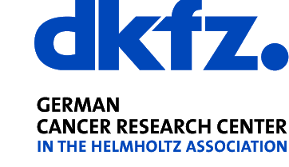

## Bio 
Hakime Öztürk is currently a post-doctoral researcher in [Computational Genomics and System Genetics group](https://www.dkfz.de/en/bioinformatik-genomik-systemgenetik/), which is led by **Dr. Oliver Stegle**, in 
[German Cancer Research Center (DKFZ)](https://www.dkfz.de/en/index.html).  

Her research interests include Bioinformatics, Information Retrieval and Machine Learning. 
Hakime was previously a member of [AILAB](http://ailab.cmpe.boun.edu.tr/), [TABILAB](http://tabilab.cmpe.boun.edu.tr/), and [OzkirimliLab](http://www.che.boun.edu.tr/che_faculty/elif/main/work/index.html) in Boğaziçi University. 
She is also proud of being mentor in [DjangoGirls](https://djangogirls.org/istanbul/) events.

## Employment

   [German Cancer Research Center (DKFZ)](https://www.dkfz.de/en/index.html), Heidelberg, Germany  
   **Post-doctoral researcher**    2019- present 
   Advisor: [Dr. Oliver Stegle](https://www.dkfz.de/en/bioinformatik-genomik-systemgenetik/) 
    

   [Bogazici University](http://boun.edu.tr/), Istanbul, Turkey 
   **Teaching Assistant**    2017- 2019 
   Department of Computer Engineering  
   Courses: CMPE150 and CMPE140

  

## Education

   [Bogazici University](http://boun.edu.tr/), Istanbul, Turkey 
   **Ph.D. in Computer Engineering**    2014- 2019 
   **M.S. in Computer Engineering**     2012- 2014 
   Advisor: [Prof. Arzucan Ozgur](https://www.cmpe.boun.edu.tr/~ozgur/) 
   Co-advisor: [Prof. Elif Ozkirimli](http://ozkirimli.che.boun.edu.tr/)
    
    

   [Dokuz Eylul University](http://www.deu.edu.tr/), Izmir, Turkey 
   **B.S. in Computer Engineering (with Honors)**    2008- 2012 
   Advisor: [Prof. Suleyman Sevinc](http://kisi.deu.edu.tr/suleyman.sevinc/)

  

## Published Papers

1. 	[Exploring chemical space using natural language processing methodologies for drug discovery.](https://www.sciencedirect.com/science/article/pii/S1359644620300465)   
	*Öztürk, Hakime, Arzucan Özgür, Philippe Schwaller, Teodoro Laino and Elif Ozkirimli.*  
	Drug Discovery Today (2020) 

2.   [DeepDTA: Deep Drug-Target Binding Affinity Prediction.](https://academic.oup.com/bioinformatics/article/34/17/i821/5093245)   
	*Öztürk, Hakime, Elif Ozkirimli and Arzucan Özgür .*  
	Bioinformatics (2018) | [www](https://cmpe.boun.edu.tr/~hakime.ozturk/deepdta.html)

3.   [A novel methodology on distributed representations of proteins using their interacting ligands.](https://academic.oup.com/bioinformatics/article-abstract/34/13/i295/5045707)   
	*Öztürk, Hakime, Elif Ozkirimli, and Arzucan Özgür.*  
	 Bioinformatics (2018) |[www](https://cmpe.boun.edu.tr/~hakime.ozturk/smilesvec.html)

4.   [Construction of miRNA-miRNA networks revealing the complexity of miRNA-mediated mechanisms in trastuzumab treated breast cancer cell lines.](https://www.ncbi.nlm.nih.gov/pmc/articles/PMC5628841/)  
	*Cilek, Emine Ezel, Hakime Ozturk, and Bala Gur Dedeoglu* 
	 PloS one (2017) | 
	
5.   [BIOSSES: a semantic sentence similarity estimation system for the biomedical domain.](https://academic.oup.com/bioinformatics/article-abstract/33/14/i49/3953954)   
	*Soğancıoğlu, Gizem, Hakime Öztürk, and Arzucan Özgür.* 
	 Bioinformatics (2017)  | [www](http://tabilab.cmpe.boun.edu.tr/BIOSSES/)
     
6.   [A comparative study of SMILES-based compound similarity functions for drug-target interaction prediction.](https://bmcbioinformatics.biomedcentral.com/articles/10.1186/s12859-016-0977-x)  
	*Öztürk, Hakime, Elif Ozkirimli, and Arzucan Özgür.*  
	 BMC bioinformatics (2016)  | 
  
7.   [Classification of Beta-lactamases and penicillin binding proteins using ligand-centric network models.](https://www.ncbi.nlm.nih.gov/pmc/articles/PMC4331424/)   
	*Öztürk, Hakime, Elif Ozkirimli, and Arzucan Özgür.*  
	PloS one (2015) |  [PLITOOL](http://tabilab.cmpe.boun.edu.tr:8080/PLITOOL/faces/index.xhtml)
	 

## Workshop Papers

8.   [CNN-based Chemical-Protein Interactions Classification](http://www.biocreative.org/media/store/files/2018/BC6_track5_11.pdf)  
	*Yüksel, Atakan,  Hakime Öztürk, Arzucan Özgür  and Elif Ozkirimli.*  
	Proceedings of the BioCreative VI Workshop, Bethesda, MD  

## Preprints

9.   [WideDTA: prediction of drug-target binding affinity](https://arxiv.org/abs/1902.04166)  
	*Hakime Öztürk, Arzucan Özgür  and Elif Ozkirimli.*  
	arXiv Preprint (2019)

10.   [A chemical language based approach for protein-ligand interaction prediction](https://arxiv.org/abs/1811.00761)  
	*Hakime Öztürk, Arzucan Özgür  and Elif Ozkirimli.*  
	arXiv Preprint (2018)

## Thesis

   [Text-based Machine Learning Methodologies for Modelling Drug-Target Interactions.](https://www.cmpe.boun.edu.tr/~hakime.ozturk/articles/phdthesis.pdf)  
	*PhD Thesis - 2019*  

   [Analysing Drug Targets using Ligand Similarity.](https://www.cmpe.boun.edu.tr/~hakime.ozturk/articles/msthesis.pdf)  
	*MSc Thesis - 2014 .*  

